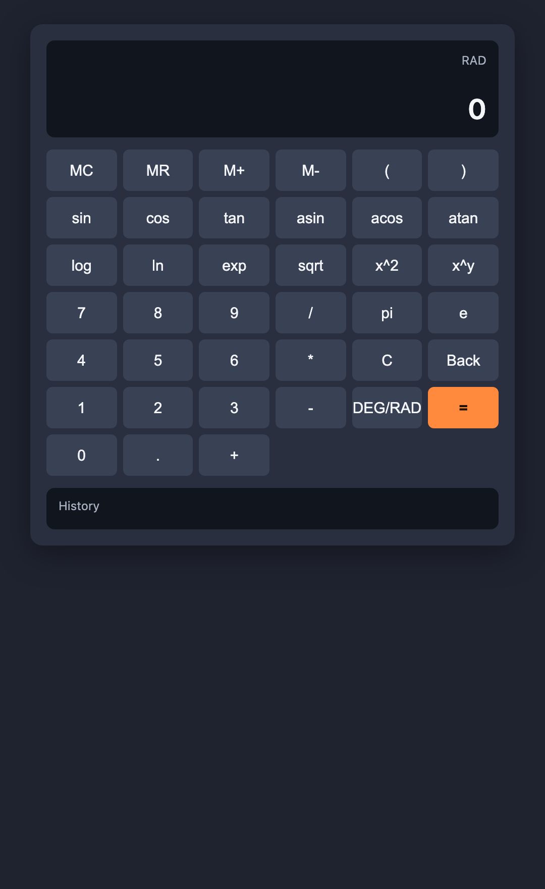
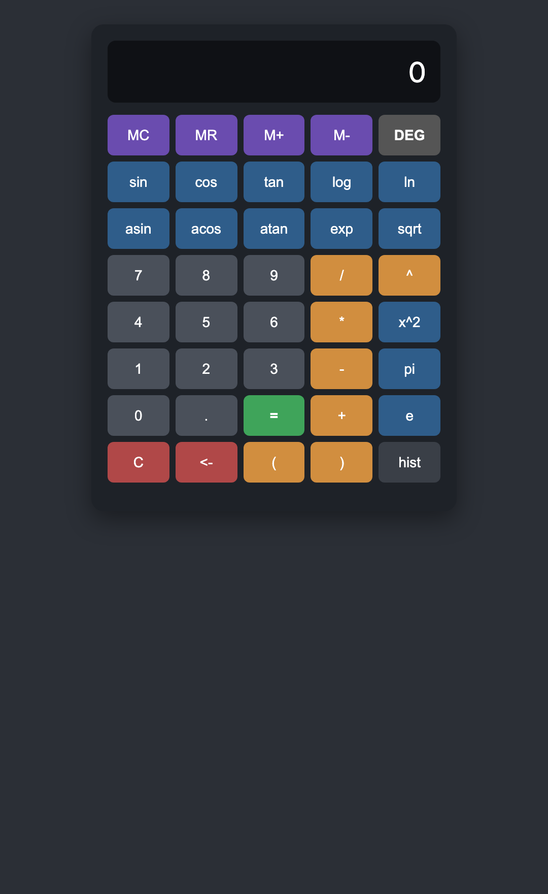
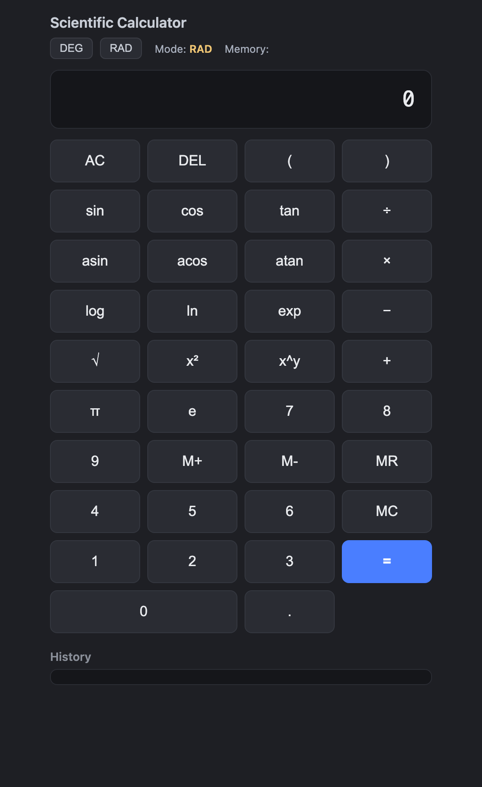
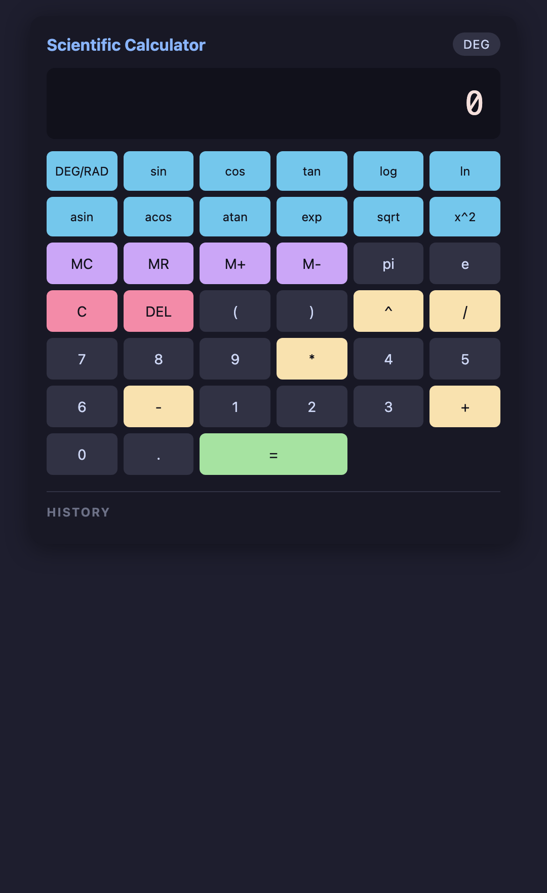
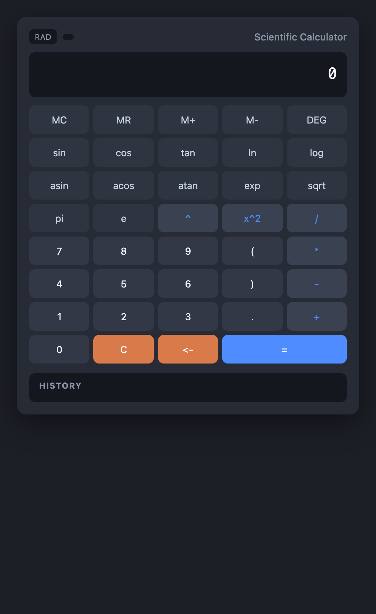
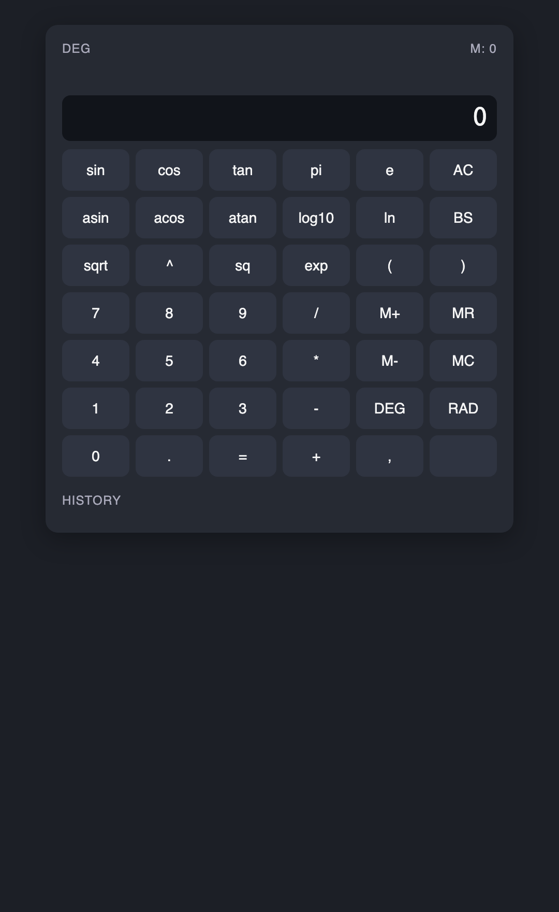

# Output Language Effect on AI-Assisted Software Engineering

**English** | [日本語](README.ja.md)

[](LICENSE)
[](analysis/reports/comparison-report-v2.md)
[](https://www.anthropic.com/claude)
[](CONTRIBUTING.md)

A pilot study measuring how Claude's **output language choice** (English vs Japanese)
affects QCD (Quality, Cost, Delivery) when building the same specified software.

**Status**: Exploratory pilot, N=3 per language group, single experimenter session.
**Conducted**: 2026-05-12 to 2026-05-15
**Model**: Anthropic Claude Opus 4.7 (`claude-opus-4-7`)
**Subject software**: Vanilla JavaScript scientific calculator (10 acceptance criteria)

---

## TL;DR

When a Japanese-native engineer asks Claude Code to build the same small program
twice — once with all output (code comments, docs, reviews) in **English**, once in
**Japanese** — the differences are:

| Dimension | English | Japanese | Verdict |
| --- | ---: | ---: | --- |
| Token consumption per build | 82,273 | 117,548 | English **30% cheaper** |
| Wall-clock time per build | 11.6 min | 14.2 min | English **18% faster** |
| Acceptance criteria pass rate | 10/10 | 10/10 | **Tied** |
| Cross-validated functional tests | 15/15 | 15/15 | **Tied** |
| Self-reported "bugs found and fixed" | 1.0/run | 0.0/run | **Disputed** (definition-dependent) |
| Source LOC | 602 | 487 | Japanese **19% more concise** |
| Comment lines | 13 | 21 | Japanese **62% more comments** |
| Tests written | 43 | 53 | Japanese **25% more tests** |

**Headline finding**: the often-cited "Japanese costs 5.6× more tokens" prediction
(based on `tiktoken` calibration on pure prose) is **incorrect for real software
engineering work** — the effective multiplier is ~1.4×, because most output is
language-neutral code, configuration, and English-styled metadata.

**Most important methodological finding**: Claude's natural generation variance
(within-language, between independent agent invocations) is **comparable to or
larger than** the language effect on most metrics. Confident QCD comparisons of
AI behavior require **N ≥ 10 replicates per condition**.

See `analysis/reports/comparison-report-v2.md` for full analysis.

---

## What the experiment actually produced

Each agent ran the same 10-acceptance-criteria specification and produced
a working scientific calculator. Here is what 6 independent Claude Opus
agents produced from identical input.

### The 6 calculators (initial state, double-clicked from `index.html`)

| English Output (3 replicates) | Japanese Output (3 replicates) |
| :---: | :---: |
|  **calc-en-1** — 6-column compact, orange `=` |  **calc-jp-1** — 5-column colorful (purple memory, blue functions, orange ops, green `=`) |
|  **calc-en-2** — 4-column spacious, "Scientific Calculator" heading, blue `=` |  **calc-jp-2** — 6-column heavily color-coded (sky-blue functions, purple memory, pink C/DEL) |
|  **calc-en-3** — 5-column with operator accents (orange C/Backspace, blue `=`/`x²`) |  **calc-jp-3** — 6-column entirely monochrome, smallest visual footprint |

**Visual variance is enormous within both languages.** The intuition that
"English = monochrome, Japanese = colorful" turns out to be wrong:
calc-jp-3 is the most monochrome of all six, while calc-en-1 has the
boldest accent. **The variance between two English replicates (en-1 vs
en-2) is comparable to the variance between English and Japanese as
groups.** This is the visual confirmation of finding H6 (within-language
variance ≈ between-language variance).

### Repository scale per build

What 1 Claude Opus agent produced from the 10-AC specification (median of 6 builds):

| Artifact | Median scale |
| --- | --- |
| Source code (`src/`) | 5 files, ~510 LOC, 3 ES modules + 1 HTML + 1 CSS |
| Tests (`tests/`) | 5 files (4 `.mjs` unit + 1 `.spec.mjs` Playwright) |
| Plan documents (`docs/plans/`) | 5 markdown files (Phase 01, 02, 03, 08, 10) |
| SC review evidence (`.claude/reviews/`) | 9 markdown files (Phase 01..08, 10) with YAML frontmatter |
| Phase markers (`.phase-{start,end}-NN`) | 18 timestamp files (9 phases × 2) |
| METRICS.md | 1 file with per-phase log table |
| Test cases passing | 31–77 (median 47) |
| Wall-clock time per agent | 7.8–14.8 min (median 11.7 min) |
| Token spend per agent | 71K–139K (median 102K) |

### What each Phase produced (calc-en-1 sizes shown)

| Phase | Artifact | Size | What it contains |
| --- | --- | ---: | --- |
| **01 Requirements** | `docs/plans/01-requirements.md` + SC review | 76 lines, 3.7 KB | 10 ACs restated with test_layer mapping, NFRs, out-of-scope, risks |
| **02 Architecture** | `docs/plans/02-architecture.md` + ADR + SC review | 102 lines, 3.4 KB | "Vanilla JS classic-script IIFE" ADR, alternatives evaluated (TS, modules, frameworks), file layout decision |
| **03 Detailed Design** | `docs/plans/03-design.md` + SC review | 148 lines, 6.0 KB | Module contracts (engine.evaluate, state shape), UI grid, error taxonomy, keyboard map, display-rounding rules |
| **04 Implementation** | `src/index.html`, `styles.css`, `engine.js`, `state.js`, `ui.js` + SC review | ~510 LOC across 5 files | Complete calculator: parser, RPN evaluator, immutable state, DOM wiring |
| **05 Unit Test** | `tests/engine.test.mjs`, `state.test.mjs` + SC review | 30+14 unit tests | AC-01..06 + AC-09 verified in isolation, ~95% engine.js branch coverage |
| **06 Integration Test** | `tests/integration.test.mjs` + SC review | 5 tests | Engine ↔ state interaction (history fills correctly, mode switch propagates, errors don't corrupt state) |
| **07 System Test** | `tests/system.spec.mjs` + SC review | 7 Playwright tests against `file://` | AC-08 (keyboard), AC-10 (local launch), end-to-end smoke flows in real Chromium |
| **08 Pull Request** | `docs/plans/08-pull-request.md` + 4-agent SC review | 70 lines, 3.1 KB | DoD checklist, AC final status, notable bugs and how they were fixed, file change summary |
| **10 Retrospective** | `docs/plans/10-retrospective.md` + SC review | 48 lines, 2.1 KB | Keep / Problem / Try in the agent's own voice, quantitative metrics |

Phase 3a (Annotation Cycle) was skipped because it requires human review;
Phase 9 (Incident) was N/A because there's no production deployment.

### Quality differences observed (with examples)

Same specification, but the agents made very different choices:

- **Algorithm choice**: calc-en-1 uses a **recursive-descent parser**;
  calc-jp-1 uses **shunting-yard**. Same correctness, different code.
- **Comment density**: English averages 13 comment lines, Japanese 21
  (Japanese comments per line are typically denser too).
- **Test naming style**:
  English: `test('AC-01 addition', ...)`
  Japanese: `test('AC-01 四則演算: 加算', ...)` (more hierarchical naming
  inflates test count without inflating assertion count proportionally).
- **Self-reported "bug" definition**: English agents counted "test
  expectation adjustments" as bugs (3 total); Japanese agents counted the
  same kind of action as 0 bugs — a self-report bias documented in
  `analysis/reports/ds_perspective.md` § 7.
- **Cross-validation**: when run through the same 15 standard test cases
  (sin(0), sin(90 DEG), 1/0, sqrt(-1), log10(1000), etc.), all 6
  calculators returned correct results or correctly rejected invalid
  inputs. **Functional quality is equivalent across all 6.**

---

## What's in this repository

```
calc-experiment/
├── README.md                            ← you are here
├── PLAN.md                              ← experimental design (v2.3)
├── METHODOLOGY.md                       ← how the experiment was actually run
├── LICENSE                              ← MIT
├── SYSTEM_BOUNDARY.md                   ← scope boundary for SD model
├── MODEL_LIMITATIONS.md                 ← honest list of model assumptions
│
├── model/
│   └── language_experiment.xmile        ← System Dynamics model used to generate
│                                          pre-registered hypotheses (ISO 18722)
│
├── analysis/
│   ├── scripts/                         ← reproducible analysis pipeline
│   │   ├── measure_token_density.py     ← tiktoken calibration for H1
│   │   ├── run_comparison.py            ← SD baseline run
│   │   ├── run_phased.py                ← SD per-phase orchestrator
│   │   ├── sensitivity_sobol.py         ← SALib Sobol global sensitivity
│   │   ├── monte_carlo.py               ← uncertainty propagation, 95% CI
│   │   ├── loop_dominance.py            ← feedback loop dominance via deactivation
│   │   ├── draw_cld.py                  ← networkx-rendered CLD with auto loop detection
│   │   ├── plot_bot.py                  ← Behavior over Time plots
│   │   ├── aggregate_parallel.py        ← collect metrics from runs-fresh/
│   │   ├── anova_parallel.py            ← parallel-design ANOVA
│   │   ├── compare_predictions_v2.py    ← H1..H6 verdicts
│   │   └── ds_analysis.py               ← rigorous DS-grade re-analysis
│   └── reports/                         ← all results JSON + final markdown
│
├── tests/                               ← pytest validation of the SD model
│
├── runs-fresh/                          ← v2.4 PARALLEL design (the valid data)
│   ├── calc-en-1/  ┐
│   ├── calc-en-2/  ├── 3 English replicates, each is a complete build
│   ├── calc-en-3/  ┘
│   ├── calc-jp-1/  ┐
│   ├── calc-jp-2/  ├── 3 Japanese replicates
│   └── calc-jp-3/  ┘
│       └── (each contains src/, tests/, docs/plans/, .claude/reviews/, METRICS.md,
│            .phase-{start,end}-NN markers)
│
└── runs-archive/                        ← v2.3 ABAB single-session FAILED attempt
                                            (kept for methodological transparency)
```

### The two attempts

This repo contains two attempts at the same experiment:

1. **`runs-archive/`** — v2.3, ABAB 4-Run cross-over, executed sequentially in a
   single Claude Code session. **Methodologically invalid** because L2 session
   isolation was broken; the position effect (sequential carryover) accounted for
   60% of the variance in time-based metrics. Kept for transparency; do not cite
   its conclusions.

2. **`runs-fresh/`** — v2.4, parallel sub-agents with isolated contexts, 3
   replicates per language. **The valid dataset.** All conclusions in
   `analysis/reports/comparison-report-v2.md` and `ds_perspective.md` come from
   this run.

---

## Reproducing the analysis

```bash
# 1. Python environment
python3.14 -m venv .venv
.venv/bin/pip install -r requirements.txt

# 2. Re-measure token density (matches tiktoken cl100k_base; takes ~5 s)
.venv/bin/python analysis/scripts/measure_token_density.py

# 3. Aggregate the per-agent metrics from runs-fresh/
.venv/bin/python analysis/scripts/aggregate_parallel.py

# 4. ANOVA + statistics
.venv/bin/python analysis/scripts/anova_parallel.py
.venv/bin/python analysis/scripts/ds_analysis.py
.venv/bin/python analysis/scripts/compare_predictions_v2.py

# 5. (Optional) Re-run SD model and sensitivity analysis
.venv/bin/python analysis/scripts/run_comparison.py
.venv/bin/python analysis/scripts/sensitivity_sobol.py
.venv/bin/python analysis/scripts/monte_carlo.py
.venv/bin/python analysis/scripts/loop_dominance.py
.venv/bin/python analysis/scripts/draw_cld.py
.venv/bin/python analysis/scripts/plot_bot.py

# 6. Run the SD-model self-tests (Sterman validation suite, pytest)
.venv/bin/pytest tests/ -v
```

To re-run a single calculator build (in any one of `runs-fresh/calc-*/`):

```bash
cd runs-fresh/calc-en-1
npm install
npm test
node --test tests/system.spec.mjs
```

To **replicate the experiment from scratch** (spawn 6 agents): see `METHODOLOGY.md`.

---

## Pre-registered hypotheses (locked before data collection)

Encoded in the SD model `model/language_experiment.xmile` and frozen in PLAN.md
v2.3 § 8 before any agent was spawned.

| H | Prediction | Verdict |
| --- | --- | --- |
| H1 | JA/EN total token ratio ≈ **5.57×** (from tiktoken on pure prose) | ❌ DEVIATED — observed **1.43×** for total tokens |
| H2 | JA reduces clarification interventions for JA-native user | ⚠️ INDETERMINATE — auto mode produced zero interventions |
| H3 | Quality (defects, AC pass) shows no language effect | ⚠️ DEVIATED-FORMALLY (JP fewer self-reported bugs), but disputed by definition (see `ds_perspective.md`) |
| H4 (revised) | Position effect ≈ 0 by parallel design | ✅ STRUCTURALLY ZERO |
| H5 | B1 cognitive-load self-balancing loop is dominant | NOT TESTABLE — model-internal claim |
| H6 (added) | Within-language variance < between-language variance | ❌ REFUTED — within ≈ between for most metrics |

---

## Honest limitations

Read these before drawing strong conclusions from the numbers above. Each item
explains what the limitation is and how it should change your interpretation of
the results.

- **Sample size is small (N = 3 per group).** This is a pilot, not a confirmatory
  study. Only one metric — "active time" — reached the conventional p < 0.05
  threshold (Welch's t-test p = 0.048; Welch's t-test compares means between two
  small samples without assuming equal variance). Even that result does not
  survive **Bonferroni correction**, a standard adjustment that raises the
  significance bar when you test many metrics at once to avoid false positives.
  Treat all numerical differences as **suggestive, not proven**.

- **Single model, single version.** All six builds used the same release of
  Claude Opus 4.7. We do not know whether the same effects (or their direction)
  hold for other models, other vendors, or even later Opus releases. Do not
  generalize beyond "this model, on this task, at this point in time."

- **Fully autonomous runs prevent measuring user comprehension.** Agents ran
  without human intervention, so we never observed the user re-reading or asking
  for clarification. Hypothesis H2 ("Japanese output reduces comprehension burden
  for a Japanese-native user") is therefore **untestable from this dataset**, not
  refuted.

- **Algorithm choice is confounded with language.** We discovered after the fact
  that English-language agents tended to implement the calculator with one
  parsing algorithm (recursive descent) while Japanese-language agents tended to
  pick another (shunting-yard). A **confounder** is a third variable that moves
  along with the variable you think you are measuring. Some of what looks like
  "language effect" in LOC, comments, and test counts is actually
  "algorithm-choice effect."

- **"Bug count" depends on who's counting.** Bugs are self-reported by the agent
  during its build. English and Japanese agents applied the definition of "bug"
  differently — for example, treating a refactoring step as a bug fix or not
  (see `analysis/reports/ds_perspective.md` § 7). The bug-count gap may be
  partly a reporting-style gap, not a quality gap.

- **The target program is tiny (~500 LOC).** A calculator does not exercise
  cross-module design, long-lived state, or large dependency graphs. Effects on
  larger codebases may be larger, smaller, or qualitatively different.

- **The orchestrator was not reset between runs.** A single human (this README's
  author) supervised all six spawns in one continuous session. The orchestrator's
  own conversation context — earlier instructions, mental state, accumulated
  prompts — carried over from one agent spawn to the next, which could have
  introduced subtle drift in how each run was launched.

---

## License

MIT — see `LICENSE`.

## Citing

If you use these results in your own work:

```
Miyoshi, S. (2026). Output Language Effect on AI-Assisted Software Engineering:
A Pilot Study with Claude Opus 4.7.
Sports AI Science. https://github.com/<your-org>/calc-experiment
```

## Author

三好修司 / Shuji Miyoshi (Sports AI Science). Designed and executed with Claude Code.
